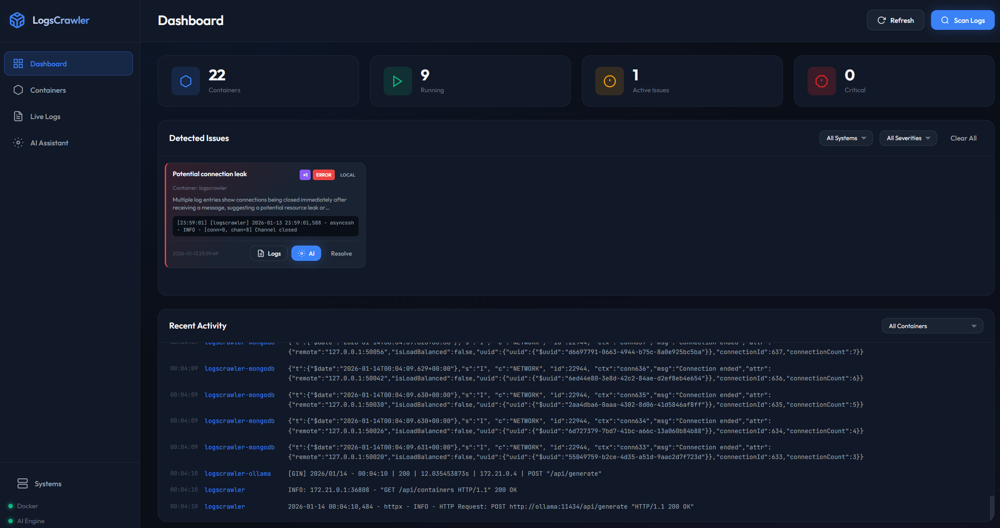
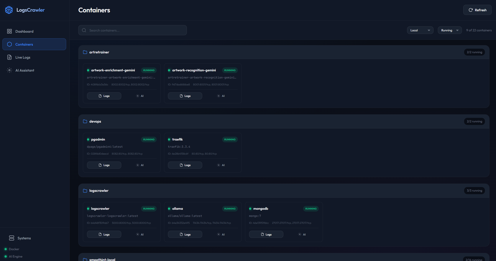

# LogsCrawler 🐳

A professional Docker log monitoring solution with AI-powered issue detection. Browse your Docker Compose or Swarm logs in real-time and automatically detect issues using a local LLM.
You can run it optionally without a GPU but many features wont work.

## Screenshots

### Dashboard
Real-time overview with AI-powered issue detection and live log streaming:



### Containers View
Browse all your containers grouped by Docker Compose projects:



## Features

- 🎯 **Real-time Log Streaming**: Live log monitoring for all containers via WebSocket
- 🤖 **AI-Powered Analysis**: Local LLM (Ollama) for intelligent log analysis and issue detection
- 📊 **Professional Dashboard**: Modern, responsive web interface with multiple views
- 🔍 **Automatic Issue Detection**: Pattern-based and AI-driven issue identification
- 💬 **AI Chat Assistant**: Ask questions about your logs and get intelligent responses
- 🚀 **No Database Required**: All data retrieved in real-time from Docker
- 🎨 **Beautiful UI**: Dark theme with professional design
- 🌐 **Remote Systems**: Monitor containers on remote servers via SSH

## Architecture

```
┌─────────────────┐
│   Web Browser   │
│   (Dashboard)   │
└────────┬────────┘
         │ HTTP/WebSocket
         │
┌────────▼────────┐      ┌──────────────┐
│  LogsCrawler    │◄─────►│   Ollama     │
│  (FastAPI)      │       │  (Local LLM) │
└────────┬────────┘       └──────────────┘
         │
         │ Docker API
         │
┌────────▼────────┐
│  Docker Daemon  │
│  (Containers)   │
└─────────────────┘
```

## Prerequisites

- Docker and Docker Compose installed
- NVIDIA GPU with CUDA support (for GPU acceleration) - Optional, CPU mode available
- NVIDIA Container Toolkit (for GPU support) - Optional

### Installing NVIDIA Container Toolkit (for GPU support)

```bash
# Ubuntu/Debian
distribution=$(. /etc/os-release;echo $ID$VERSION_ID)
curl -s -L https://nvidia.github.io/nvidia-docker/gpgkey | sudo apt-key add -
curl -s -L https://nvidia.github.io/nvidia-docker/$distribution/nvidia-docker.list | sudo tee /etc/apt/sources.list.d/nvidia-docker.list

sudo apt-get update && sudo apt-get install -y nvidia-container-toolkit
sudo systemctl restart docker
```

## Quick Start

### 1. Clone the repository

```bash
git clone <repository-url>
cd LogsCrawler
```

### 2. Choose your configuration

**For GPU support (RTX 5080, etc.):**
```bash
docker-compose up -d
```

**For CPU-only:**
```bash
docker-compose -f docker-compose.cpu.yml up -d
```

### 3. Pull and run an LLM model

Once Ollama is running, you need to pull a model:

```bash
# Access the Ollama container
docker exec -it logscrawler-ollama ollama pull llama3.2

# Or use a larger model for better results
docker exec -it logscrawler-ollama ollama pull llama3.1:8b
docker exec -it logscrawler-ollama ollama pull mistral
```

### 4. Configure the model (optional)

Edit `docker-compose.yml` and set your preferred model:

```yaml
environment:
  - LOGSCRAWLER_OLLAMA_MODEL=llama3.2  # Change to your model
```

Then restart:
```bash
docker-compose restart logscrawler
```

### 5. Access the dashboard

Open your browser and navigate to:
```
http://localhost:5000
```

## Configuration

### Environment Variables

Create a `.env` file in the project root (see `.env.example`):

```bash
# Application
LOGSCRAWLER_APP_NAME=LogsCrawler
LOGSCRAWLER_DEBUG=false

# Server
LOGSCRAWLER_HOST=0.0.0.0
LOGSCRAWLER_PORT=8000

# Docker
LOGSCRAWLER_DOCKER_HOST=unix:///var/run/docker.sock  # Linux/Mac
# LOGSCRAWLER_DOCKER_HOST=tcp://localhost:2375      # Windows

# Ollama LLM
LOGSCRAWLER_OLLAMA_HOST=http://ollama:11434
LOGSCRAWLER_OLLAMA_MODEL=llama3.2

# Log Settings
LOGSCRAWLER_LOG_TAIL_LINES=500
LOGSCRAWLER_LOG_STREAM_INTERVAL=1.0

# AI Analysis
LOGSCRAWLER_ANALYSIS_INTERVAL=60
LOGSCRAWLER_MAX_LOG_CONTEXT=4000
```

### Docker Compose Configuration

The main `docker-compose.yml` includes GPU support. For systems without GPU, use `docker-compose.cpu.yml`.

**GPU Configuration:**
- Automatically detects and uses all available GPUs
- Optimized for NVIDIA RTX series (including RTX 5080)
- Falls back to CPU if GPU unavailable

## Usage

### Dashboard View

- **Overview**: Container statistics and recent activity
- **Issues Panel**: Automatically detected issues with severity levels
- **Recent Logs**: Live feed of recent log entries

### Containers View

- Browse all containers (running and stopped)
- View container details (image, ports, status)
- Quick access to container logs
- Analyze specific containers with AI

### Live Logs View

- Real-time log streaming from selected containers
- Filter logs by container
- Search functionality
- Auto-scroll toggle
- Pause/Resume controls

### AI Assistant View

- Chat with AI about your logs
- Ask questions like:
  - "Are there any errors in the recent logs?"
  - "What containers have warnings?"
  - "Summarize the recent activity"
- Include/exclude logs in context
- Select specific containers for analysis

## API Endpoints

### Health & Status
- `GET /api/health` - Service health check
- `GET /api/status` - Detailed system status

### Containers
- `GET /api/containers` - List all containers
- `GET /api/containers/{id}` - Get container details

### Logs
- `GET /api/logs` - Get logs from all containers
- `GET /api/logs/{container_id}` - Get logs from specific container

### AI Analysis
- `POST /api/ai/analyze` - Analyze logs with AI
- `POST /api/ai/chat` - Chat with AI about logs
- `GET /api/ai/models` - List available AI models

### Issues
- `GET /api/issues` - Get detected issues
- `POST /api/issues/scan` - Manually scan for issues
- `POST /api/issues/{id}/resolve` - Mark issue as resolved

### WebSocket Endpoints
- `ws://localhost:8000/ws/logs` - Stream all logs
- `ws://localhost:8000/ws/logs/{container_id}` - Stream container logs
- `ws://localhost:8000/ws/issues` - Stream detected issues
- `ws://localhost:8000/ws/chat` - AI chat streaming

## Development


### Project Structure

```
LogsCrawler/
├── app/
│   ├── __init__.py
│   ├── main.py              # FastAPI application
│   ├── config.py            # Configuration settings
│   ├── models.py            # Pydantic models
│   ├── api/
│   │   ├── routes.py        # REST API endpoints
│   │   └── websocket.py     # WebSocket handlers
│   ├── services/
│   │   ├── docker_service.py # Docker integration
│   │   └── ai_service.py    # AI/LLM integration
│   └── static/
│       ├── index.html       # Frontend HTML
│       ├── app.js           # Frontend JavaScript
│       └── styles.css      # Frontend CSS
├── docker-compose.yml       # GPU-enabled compose
├── docker-compose.cpu.yml  # CPU-only compose
├── Dockerfile              # Application container
├── requirements.txt         # Python dependencies
└── README.md
```

## Troubleshooting

### Docker daemon not accessible

**Linux/Mac:**
- Ensure Docker socket permissions: `sudo chmod 666 /var/run/docker.sock`
- Or add user to docker group: `sudo usermod -aG docker $USER`

**Windows (Docker Desktop):**
- The default configuration should work with Docker Desktop
- If issues occur, enable Docker Desktop API: Settings → General → Expose daemon on tcp://localhost:2375
- For Windows containers, you may need to use `npipe:////./pipe/docker_engine` instead
- The volume mount `/var/run/docker.sock:/var/run/docker.sock:ro` works because Docker Desktop runs a Linux VM

### GPU not detected

1. Verify NVIDIA drivers:
```bash
nvidia-smi
```

2. Check NVIDIA Container Toolkit:
```bash
docker run --rm --gpus all nvidia/cuda:11.0-base nvidia-smi
```

3. Verify docker-compose GPU config:
```yaml
deploy:
  resources:
    reservations:
      devices:
        - driver: nvidia
          count: all
          capabilities: [gpu]
```


## Performance Tips

1. **Model Selection**: Smaller models (llama3.2) are faster but less accurate. Larger models (llama3.1:8b) are more accurate but slower.

2. **Analysis Interval**: Adjust `LOGSCRAWLER_ANALYSIS_INTERVAL` to balance between responsiveness and resource usage.

3. **Log Context**: Reduce `LOGSCRAWLER_MAX_LOG_CONTEXT` if experiencing slow AI responses.

4. **GPU Memory**: Ensure sufficient GPU memory for your chosen model:
   - llama3.2: ~2GB
   - llama3.1:8b: ~5GB
   - mistral:7b: ~4GB

## Security Notes

⚠️ **Important**: This application is designed for internal/development use. It does not include authentication. Do not expose to the internet without proper security measures.

- The application requires access to the Docker socket
- No authentication is implemented
- All logs are accessible to anyone with network access
- Consider adding authentication for production use

## License

See [LICENSE.md](LICENSE.md) for details.

## Contributing

Contributions are welcome! Please feel free to submit a Pull Request.

## Support

For issues, questions, or feature requests, please open an issue on GitHub.

---

**Made with ❤️ for DevOps teams**
