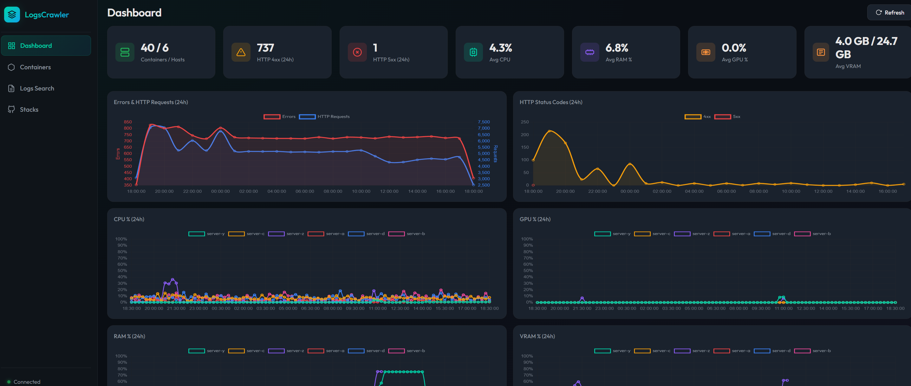
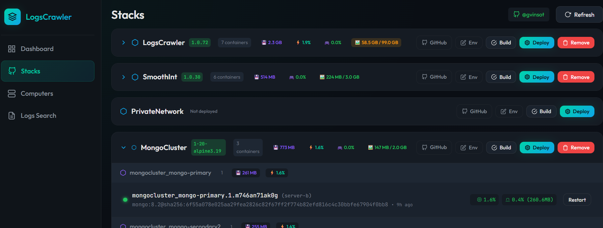

# LogsCrawler


*Dashboard: Real-time metrics, error tracking, and resource monitoring*


*Stacks: Build and deploy directly from your GitHub repositories*

**Stop switching between GitHub, Portainer, Grafana, and terminal windows.** LogsCrawler is an all-in-one DevOps platform that unifies your entire container workflow into a single, modern interface.

Built for **homelab enthusiasts** and small-scale DevOps teams who want the power of enterprise tools without the complexity. Star a repo on GitHub, build it, deploy it to your Swarm cluster, and monitor it — all from one dashboard.

## Why LogsCrawler?

If you're tired of:
- Jumping between GitHub, CI/CD pipelines, and deployment tools
- SSHing into multiple machines to check logs
- Managing Docker containers across different hosts
- Setting up separate monitoring stacks

Then LogsCrawler is for you. **One tool. One interface. Complete control.**

## Key Capabilities

| Build | Deploy | Monitor | Manage |
|-------|--------|---------|--------|
| Clone from GitHub | Docker Swarm stacks | Centralized logs | Start/Stop containers |
| Multi-branch builds | Environment config | Real-time metrics | Exec into containers |
| Version tagging | Rolling updates | AI-powered search | Resource limits |
| Build history | Rollback support | Error tracking | Grouped views |

## Features

### 🔗 GitHub Integration
- **Starred Repos**: Your starred repositories appear automatically
- **Branch Selection**: Build from any branch or specific commit
- **Compose Detection**: Automatically finds docker-compose files
- **Version Management**: Tag your builds with semantic versions

### 🏗️ Build & Deploy
- **One-Click Builds**: Build Docker images directly from your repos
- **Docker Swarm**: Deploy as Swarm stacks for high availability
- **Environment Management**: Configure environment variables per stack
- **Tag Selection**: Deploy specific versions or latest builds

### 📊 Monitoring & Logs
- **Centralized Log Collection**: Agents collect logs from all containers across all hosts
- **Full-Text Search**: Powerful OpenSearch-backed queries
- **AI-Powered Search**: Natural language queries via Ollama (e.g., "show me errors from nginx in the last hour")
- **Real-Time Metrics**: CPU, Memory, GPU (AMD/NVIDIA), Disk usage
- **Error Tracking**: 4xx/5xx HTTP error counts and trends

### 🖥️ Container Management
- **Multi-Host View**: See all containers grouped by host and Compose project
- **Container Actions**: Start, Stop, Restart, Pause/Unpause from the UI
- **Live Logs**: Stream container logs in real-time
- **Resource Stats**: Monitor CPU/Memory usage per container

### 📈 Dashboard
- **Summary Statistics**: Running containers, hosts, error counts at a glance
- **Time Series Charts**: Visualize resource usage and error patterns over 24h
- **HTTP Status Distribution**: Track 4xx/5xx breakdown

## Architecture

LogsCrawler uses an **agent-based architecture** where lightweight agents run on each host:

```
┌─────────────────────────────────────────────────────────────────────────────┐
│                           Central Server                                    │
│  ┌─────────────┐    ┌─────────────────┐    ┌──────────────┐                 │
│  │  Frontend   │    │    FastAPI      │    │    Ollama    │                 │
│  │  (HTML/JS)  │◄──►│    Backend      │◄──►│   (AI/LLM)   │                 │
│  └─────────────┘    └────────┬────────┘    └──────────────┘                 │
│                              │                                              │
│                      ┌───────┴───────┐                                      │
│                      │   Actions     │◄──── Container actions queue         │
│                      │    Queue      │      (start, stop, exec, etc.)       │
│                      └───────┬───────┘                                      │
└──────────────────────────────┼──────────────────────────────────────────────┘
                               │ Agents poll for actions
                               ▼
┌──────────────────────────────────────────────────────────────────────────────┐
│                            OpenSearch                                        │
│                      (Logs, Metrics, Search)                                 │
└────────────────────────────────▲─────────────────────────────────────────────┘
                                 │ Direct writes
         ┌───────────────────────┼───────────────────────┐
         │                       │                       │
┌────────┴────────┐    ┌─────────┴───────┐    ┌─────────┴───────┐
│    Host 1       │    │     Host 2      │    │     Host N      │
│  ┌───────────┐  │    │  ┌───────────┐  │    │  ┌───────────┐  │
│  │   Agent   │  │    │  │   Agent   │  │    │  │   Agent   │  │
│  └─────┬─────┘  │    │  └─────┬─────┘  │    │  └─────┬─────┘  │
│        │        │    │        │        │    │        │        │
│  ┌─────▼─────┐  │    │  ┌─────▼─────┐  │    │  ┌─────▼─────┐  │
│  │  Docker   │  │    │  │  Docker   │  │    │  │  Docker   │  │
│  │ Containers│  │    │  │ Containers│  │    │  │ Containers│  │
│  └───────────┘  │    │  └───────────┘  │    │  └───────────┘  │
└─────────────────┘    └─────────────────┘    └─────────────────┘
```

### How It Works

1. **Agents** run on each host and:
   - Collect Docker container logs and metrics locally
   - Write data directly to OpenSearch (no backend bottleneck)
   - Poll the backend for actions (start, stop, restart, exec commands)
   - Execute container actions and report results

2. **Backend** serves as the coordination layer:
   - Provides REST API for the frontend
   - Manages the actions queue for agent communication
   - Integrates with Ollama for AI-powered log search
   - Handles GitHub integration for stack deployment

3. **Frontend** provides the user interface:
   - Dashboard with metrics and error trends
   - Log search with natural language support
   - Container management across all hosts
   - Stack deployment from GitHub

## Quick Start

### Prerequisites

- Docker & Docker Compose
- Docker installed on all hosts you want to monitor

### 1. Start the Central Server

```bash
git clone https://github.com/yourusername/logscrawler.git
cd logscrawler

# Start backend, frontend, and OpenSearch
docker-compose up -d
```

### 2. Deploy Agents on Each Host

On each host you want to monitor, deploy the agent:

```bash
# Set environment variables
export BACKEND_URL=http://your-central-server:5000
export OPENSEARCH_HOSTS='["http://your-central-server:9200"]'
export AGENT_ID=$(hostname)

# Run the agent
docker-compose -f docker-compose.agent.yml up -d
```

### 3. Access the Dashboard

Open http://localhost:5000 in your browser.

## Configuration

### Central Server Configuration

All configuration is done via **environment variables** in `docker-compose.yml`:

```yaml
environment:
  # OpenSearch connection
  - LOGSCRAWLER_OPENSEARCH__HOSTS=["http://opensearch:9200"]
  - LOGSCRAWLER_OPENSEARCH__INDEX_PREFIX=logscrawler

  # AI/Ollama configuration (optional - for natural language search)
  - LOGSCRAWLER_AI__MODEL=llama3.2:latest
  - LOGSCRAWLER_OLLAMA_URL=http://your-ollama-server:11434

  # GitHub integration (optional - for stack deployment)
  - LOGSCRAWLER_GITHUB__TOKEN=ghp_your_token_here

  # Collector settings
  - LOGSCRAWLER_COLLECTOR__LOG_INTERVAL_SECONDS=30
  - LOGSCRAWLER_COLLECTOR__METRICS_INTERVAL_SECONDS=15
  - LOGSCRAWLER_COLLECTOR__RETENTION_DAYS=7
```

### Agent Configuration

Configure each agent via environment variables in `docker-compose.agent.yml`:

```yaml
environment:
  # Unique agent ID (defaults to hostname)
  - AGENT_AGENT_ID=${AGENT_ID:-$(hostname)}

  # Backend URL for polling actions
  - AGENT_BACKEND_URL=http://logscrawler-backend:5000

  # OpenSearch connection (direct writes)
  - AGENT_OPENSEARCH__HOSTS=["http://opensearch:9200"]

  # Collection intervals (seconds)
  - AGENT_LOG_INTERVAL=30
  - AGENT_METRICS_INTERVAL=15
  - AGENT_ACTION_POLL_INTERVAL=2
```

### Legacy SSH Mode (Optional)

For backwards compatibility, you can still monitor remote hosts via SSH from the central server:

```yaml
environment:
  - |
    LOGSCRAWLER_HOSTS=[
      {"name": "local", "mode": "docker"},
      {"name": "server-1", "mode": "ssh", "hostname": "192.168.1.10", "username": "deploy"},
      {"name": "server-2", "mode": "ssh", "hostname": "192.168.1.11", "username": "deploy"}
    ]
volumes:
  - ~/.ssh:/root/.ssh:ro  # Mount SSH keys
```

## Development Setup

### Without Docker

```bash
# Create virtual environment
python -m venv venv
source venv/bin/activate  # Linux/macOS
# or: venv\Scripts\activate  # Windows

# Install dependencies
pip install -r requirements.txt

# Start OpenSearch (required)
docker run -d -p 9200:9200 -e "discovery.type=single-node" \
  -e "DISABLE_SECURITY_PLUGIN=true" \
  opensearchproject/opensearch:2.11.1

# Run the application
python -m backend.main
```

### Project Structure

```
logscrawler/
├── backend/
│   ├── __init__.py
│   ├── api.py              # FastAPI REST endpoints
│   ├── actions_queue.py    # In-memory queue for agent actions
│   ├── ai_service.py       # Ollama integration for NL queries
│   ├── collector.py        # Legacy log/metrics collection service
│   ├── config.py           # Configuration management (env vars)
│   ├── docker_client.py    # Docker API client
│   ├── github_service.py   # GitHub integration for stack deployment
│   ├── host_client.py      # Unified host client interface
│   ├── main.py             # Application entry point
│   ├── models.py           # Pydantic data models
│   ├── opensearch_client.py # OpenSearch operations
│   ├── ssh_client.py       # SSH client for remote hosts (legacy)
│   └── utils.py            # Utility functions
├── agent/
│   ├── __init__.py
│   ├── action_poller.py    # Polls backend for container actions
│   ├── config.py           # Agent configuration
│   ├── docker_collector.py # Local Docker log/metrics collection
│   ├── main.py             # Agent entry point
│   ├── opensearch_writer.py # Direct OpenSearch writes
│   ├── requirements.txt    # Agent-specific dependencies
│   └── utils.py            # Agent utility functions
├── frontend/
│   ├── index.html          # Main HTML page
│   └── static/
│       ├── css/
│       │   └── style.css   # Styles (Deep Ocean theme)
│       └── js/
│           └── app.js      # Frontend JavaScript
├── devops/
│   └── docker-compose.swarm.yml  # Docker Swarm deployment
├── docker-compose.yml          # Central server deployment
├── docker-compose.agent.yml    # Agent deployment (per host)
├── Dockerfile                  # Backend/Frontend container
├── Dockerfile.agent            # Agent container
├── requirements.txt
└── README.md
```

## API Reference

### Dashboard

| Endpoint | Method | Description |
|----------|--------|-------------|
| `/api/dashboard/stats` | GET | Get summary statistics |
| `/api/dashboard/errors-timeseries` | GET | Error count over time |
| `/api/dashboard/http-4xx-timeseries` | GET | HTTP 4xx count over time |
| `/api/dashboard/http-5xx-timeseries` | GET | HTTP 5xx count over time |
| `/api/dashboard/cpu-timeseries` | GET | CPU usage over time |
| `/api/dashboard/memory-timeseries` | GET | Memory usage over time |

### Containers

| Endpoint | Method | Description |
|----------|--------|-------------|
| `/api/containers` | GET | List all containers |
| `/api/containers/grouped` | GET | List containers grouped by host/project |
| `/api/containers/{host}/{id}/stats` | GET | Get container stats |
| `/api/containers/{host}/{id}/logs` | GET | Get container logs |
| `/api/containers/{host}/{id}/env` | GET | Get container environment variables |
| `/api/containers/action` | POST | Execute container action |

### Logs Search

| Endpoint | Method | Description |
|----------|--------|-------------|
| `/api/logs/search` | POST | Search logs with filters |
| `/api/logs/search` | GET | Search logs (query params) |
| `/api/logs/ai-search` | POST | Natural language log search (via Ollama) |
| `/api/logs/ai-analyze` | POST | AI-powered log analysis |

### AI Integration

| Endpoint | Method | Description |
|----------|--------|-------------|
| `/api/ai/status` | GET | Check Ollama connectivity and model status |

### Agent Communication

| Endpoint | Method | Description |
|----------|--------|-------------|
| `/api/agents` | GET | List connected agents and their status |
| `/api/agent/actions` | GET | Poll for pending actions (used by agents) |
| `/api/agent/result` | POST | Report action result (used by agents) |
| `/api/agent/action` | POST | Queue an action for an agent |

### Stack Deployment (GitHub Integration)

| Endpoint | Method | Description |
|----------|--------|-------------|
| `/api/stacks/status` | GET | Get deployment status |
| `/api/stacks/repos` | GET | List starred GitHub repos with compose files |
| `/api/stacks/build` | POST | Build a stack from a repo |
| `/api/stacks/deploy` | POST | Deploy a stack |
| `/api/stacks/{stack_name}/remove` | POST | Remove a deployed stack |
| `/api/stacks/{repo_name}/env` | GET | Get stack environment config |
| `/api/stacks/{repo_name}/env` | PUT | Update stack environment config |
| `/api/stacks/deployed-tags` | GET | Get deployed image tags |

#### Search Query Parameters

```json
{
  "query": "error AND timeout",
  "hosts": ["server-1"],
  "containers": ["nginx", "api"],
  "compose_projects": ["webapp"],
  "levels": ["ERROR", "WARN"],
  "http_status_min": 400,
  "http_status_max": 599,
  "start_time": "2024-01-15T00:00:00Z",
  "end_time": "2024-01-16T00:00:00Z",
  "size": 100,
  "from": 0,
  "sort_order": "desc"
}
```

### Hosts

| Endpoint | Method | Description |
|----------|--------|-------------|
| `/api/hosts` | GET | List configured hosts |
| `/api/health` | GET | Health check |

## Environment Variables Reference

### Backend (Central Server) Settings

All backend configuration is done via environment variables prefixed with `LOGSCRAWLER_`.

#### Core Settings

| Variable | Description | Default |
|----------|-------------|---------|
| `LOGSCRAWLER_DEBUG` | Enable debug mode | `false` |
| `LOGSCRAWLER_HOSTS` | JSON array of host configs (for legacy SSH mode) | `[]` |

#### OpenSearch Settings

| Variable | Description | Default |
|----------|-------------|---------|
| `LOGSCRAWLER_OPENSEARCH__HOSTS` | JSON array of OpenSearch URLs | `["http://localhost:9200"]` |
| `LOGSCRAWLER_OPENSEARCH__INDEX_PREFIX` | Index prefix | `logscrawler` |
| `LOGSCRAWLER_OPENSEARCH__USERNAME` | Username (optional) | - |
| `LOGSCRAWLER_OPENSEARCH__PASSWORD` | Password (optional) | - |

#### AI Settings

| Variable | Description | Default |
|----------|-------------|---------|
| `LOGSCRAWLER_AI__MODEL` | Ollama model name | `llama3.2:latest` |
| `LOGSCRAWLER_OLLAMA_URL` | Ollama API URL | - |

#### GitHub Settings

| Variable | Description | Default |
|----------|-------------|---------|
| `LOGSCRAWLER_GITHUB__TOKEN` | GitHub personal access token | - |

#### Collector Settings (Legacy)

| Variable | Description | Default |
|----------|-------------|---------|
| `LOGSCRAWLER_COLLECTOR__LOG_INTERVAL_SECONDS` | Log collection interval | `30` |
| `LOGSCRAWLER_COLLECTOR__METRICS_INTERVAL_SECONDS` | Metrics collection interval | `15` |
| `LOGSCRAWLER_COLLECTOR__LOG_LINES_PER_FETCH` | Lines per container per fetch | `500` |
| `LOGSCRAWLER_COLLECTOR__RETENTION_DAYS` | Data retention period | `7` |

### Agent Settings

All agent configuration is done via environment variables prefixed with `AGENT_`.

| Variable | Description | Default |
|----------|-------------|---------|
| `AGENT_AGENT_ID` | Unique identifier for this agent | hostname |
| `AGENT_BACKEND_URL` | URL of the LogsCrawler backend | `http://logscrawler-backend:8000` |
| `AGENT_DOCKER_URL` | Docker socket URL | `unix:///var/run/docker.sock` |
| `AGENT_LOG_INTERVAL` | Log collection interval (seconds) | `30` |
| `AGENT_METRICS_INTERVAL` | Metrics collection interval (seconds) | `15` |
| `AGENT_ACTION_POLL_INTERVAL` | Action polling interval (seconds) | `2` |
| `AGENT_OPENSEARCH__HOSTS` | JSON array of OpenSearch URLs | `["http://opensearch:9200"]` |
| `AGENT_OPENSEARCH__INDEX_PREFIX` | Index prefix | `logscrawler` |
| `AGENT_LOG_LEVEL` | Logging level (DEBUG, INFO, WARNING, ERROR) | `WARNING` |

### Legacy Host Configuration Options

Each host in `LOGSCRAWLER_HOSTS` supports these fields (for SSH mode):

| Field | Description | Required |
|-------|-------------|----------|
| `name` | Display name for the host | Yes |
| `mode` | Connection mode: `docker`, `ssh`, or `local` | Yes |
| `hostname` | IP or hostname (for SSH mode) | For SSH |
| `port` | SSH port | No (default: 22) |
| `username` | SSH username | For SSH |
| `docker_url` | Docker API URL (for docker mode) | No |
| `swarm_manager` | Is this a Swarm manager? | No |
| `swarm_routing` | Route commands through manager | No |
| `swarm_autodiscover` | Auto-discover Swarm nodes | No |

## Troubleshooting

### Agent Not Connecting

1. Check that the agent can reach the backend:
   ```bash
   docker exec logscrawler-agent curl http://your-backend:5000/api/health
   ```

2. Check agent logs:
   ```bash
   docker logs logscrawler-agent
   ```

3. Verify the agent is registered:
   ```bash
   curl http://localhost:5000/api/agents
   ```

### OpenSearch Connection Issues

1. Verify OpenSearch is running:
   ```bash
   curl http://localhost:9200
   ```

2. Check logs:
   ```bash
   docker-compose logs opensearch
   ```

3. Check agent OpenSearch connectivity:
   ```bash
   docker exec logscrawler-agent curl http://opensearch:9200
   ```

### No Logs Appearing

1. Check agent logs for collection errors:
   ```bash
   docker logs logscrawler-agent
   ```

2. Verify containers are running on the host:
   ```bash
   docker ps
   ```

3. Check OpenSearch indices:
   ```bash
   curl http://localhost:9200/_cat/indices?v
   ```

### AI Search Not Working

1. Check Ollama connectivity:
   ```bash
   curl http://localhost:5000/api/ai/status
   ```

2. Verify Ollama URL is configured:
   ```bash
   docker-compose logs logscrawler | grep -i ollama
   ```

### SSH Mode Issues (Legacy)

1. Ensure SSH key-based authentication is configured:
   ```bash
   ssh-copy-id user@hostname
   ```

2. Test SSH connection manually:
   ```bash
   ssh -i ~/.ssh/your_key user@hostname "docker ps"
   ```

3. Check SSH key permissions:
   ```bash
   chmod 600 ~/.ssh/your_key
   ```

## Contributing

Contributions are welcome! Please feel free to submit a Pull Request.

## License

This project is licensed under the MIT License - see the [LICENSE.md](LICENSE.md) file for details.